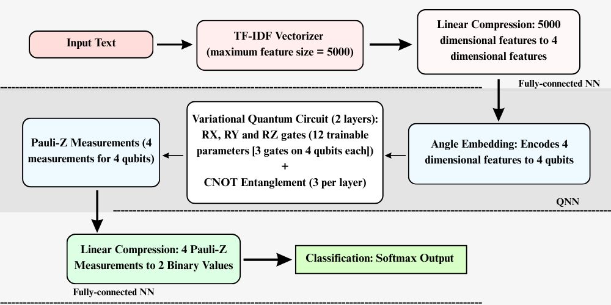
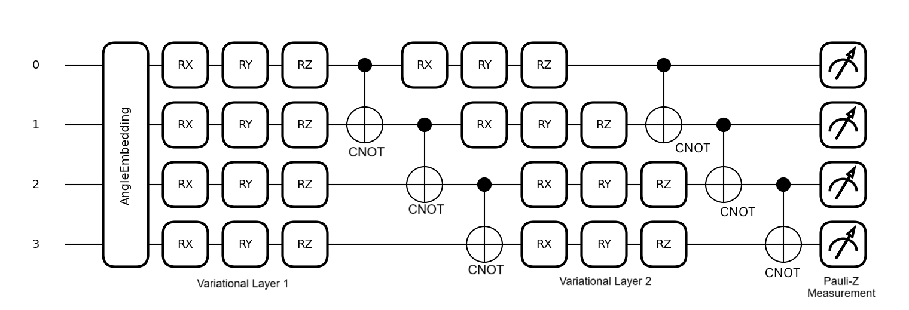

# A Primer on Quantum Neural Network Model for Text Classification: From Concept to Design
This repository contains the implementation of a hybrid quantum-classical neural network for binary text classification, combining TF-IDF feature extraction with a shallow 4-qubit variational quantum circuit (VQC) built in PennyLane and PyTorch.

## Installation

```bash
pip install pennylane torch scikit-learn numpy datasets pyyaml
```

## Datasets

The model is evaluated on five benchmark datasets for binary text classification.

| Dataset | Train | Validation | Test | Total | Labels |
|---------|-------|------------|------|-------|--------|
| MR      | 8,530 | 1,065      | 1,067 | 10,662 | pos/neg |
| SST     | 65,528 | 872       | 1,821 | 68,221 | pos/neg |
| SUBJ    | 8,000 | 1,000      | 1,000 | 10,000 | sub/obj |
| CR      | 3,024 | 364        | 384  | 3,772  | pos/neg |
| MPQA    | 8,496 | 1,035      | 1,072 | 10,603 | pos/neg |

MR, CR and SST require local files. Set the path inside `src/data.py` before running. SUBJ and MPQA are loaded automatically via the Hugging Face `datasets` library.

## Model Architecture

The pipeline consists of three stages.

1. A TF-IDF vectorizer compresses raw text into a 5,000-dimensional sparse feature vector.
2. A fully-connected linear layer with tanh activation projects the features down to 4 dimensions, one per qubit.
3. A variational quantum circuit (VQC) with 4 qubits and 2 layers applies angle embedding, parameterized RX, RY, RZ rotations, and CNOT entanglement. Pauli-Z expectation values are measured and passed to a final linear classification layer.
   

Figure 1. Flow diagram of our proposed QNN model. The core component of the pipeline is the VQC, which is further illustrated in Figure 2. 


Figure 2. Four-qubit VQC with angle embedding, parameterized RX, RY, RZ rotations, CNOT entanglement, and Pauli-Z measurements. Circuit configuration selected based on ablation studies.

Total trainable parameters: 20,038.

Run `train.py` to train and evaluate the model on any dataset. Training, validation, and test evaluation are handled in a single run.

## Usage

```bash
python -m src.train --dataset MR
```

Available arguments:

| Argument | Default | Description |
|----------|---------|-------------|
| `--dataset` | MR | Dataset name: MR, SST, SUBJ, CR, MPQA |
| `--n_qubits` | 4 | Number of qubits in the VQC |
| `--n_layers` | 2 | Number of variational layers |
| `--max_features` | 5000 | Maximum TF-IDF vocabulary size |
| `--lr` | 0.001 | Learning rate |
| `--batch_size` | 32 | Batch size |
| `--n_epochs` | 10 | Number of training epochs |

## Results

| Dataset | Accuracy | F1-Score | AUC-ROC |
|---------|----------|----------|---------|
| MR      | 0.7844   | 0.7843   | 0.8659  |
| SST     | 0.8764   | 0.8759   | 0.9462  |
| SUBJ    | 0.9170   | 0.9130   | 0.9690  |
| CR      | 0.8307   | 0.8292   | 0.8952  |
| MPQA    | 0.8731   | 0.8706   | 0.9271  |

The QNN achieves the best results on CR, SUBJ, and MPQA across all evaluated metrics.

## Citation

If you use this code, please cite our paper:

```bibtex
Will be provided once available.
```

## License

